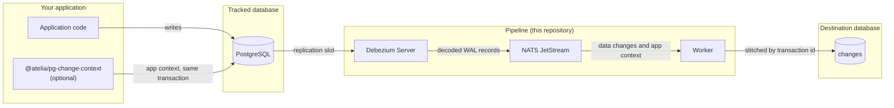

# bemi-io

A self-hosted pipeline that records every row-level change in a PostgreSQL
database into an audit table, by reading the
[Write-Ahead Log](https://www.postgresql.org/docs/current/wal-intro.html) (WAL)
and implementing [Change Data Capture](https://en.wikipedia.org/wiki/Change_data_capture)
(CDC). It runs beside the database and requires no changes to the tables it
tracks — no triggers, no extra columns, no writes on the application's path.

This is a fork of [BemiHQ/bemi-io](https://github.com/BemiHQ/bemi-io),
maintained by Atelia Health for self-hosting. See [License](#license).

## Contents

- [What you get](#what-you-get)
- [Requirements](#requirements)
- [Quickstart](#quickstart)
- [Pointing it at your own database](#pointing-it-at-your-own-database)
- [Contextualizing data changes](#contextualizing-data-changes)
- [Limiting what is captured](#limiting-what-is-captured)
- [Replication slot monitoring](#replication-slot-monitoring)
- [Architecture](#architecture)
- [Testing](#testing)
- [License](#license)

## What you get

- Complete change history — create, update and delete, with before and after
  images — written to a `changes` table you can query with SQL.
- No effect on application latency: decoding happens out of band, downstream of
  the commit.
- Durability across restarts. The replication slot holds WAL while a consumer
  is down, so writes made during an outage still land afterwards.
- Optional per-transaction application context (user, tenant, request) attached
  to the changes it caused.

## Requirements

- Docker, for the compose stack below.
- A PostgreSQL database with `SHOW wal_level;` returning `logical`. If it does
  not, set it and restart the server:

  ```sql
  ALTER SYSTEM SET wal_level = logical;
  ```

- To capture the "before" state as well as the "after", each tracked table
  needs a full replica identity:

  ```sql
  ALTER TABLE [tracked_table_name] REPLICA IDENTITY FULL;
  ```

Running the stack outside Docker additionally needs Node.js, Java, and a
[NATS server](https://github.com/nats-io/nats-server).

## Quickstart

`docker-compose.yml` stands up the whole pipeline — PostgreSQL, NATS, Debezium
and the worker — against a throwaway database, which is the fastest way to see
it work:

```sh
docker compose up -d --build
```

The `db` service starts with `wal_level=logical`, creates a `todos` table in
`appdb` and a separate `audit` database for the change log. Make a change:

```sh
docker exec bemi-db-1 psql -U postgres -d appdb \
  -c "INSERT INTO todos (title) VALUES ('first'); UPDATE todos SET status='done' WHERE title='first';"
```

Within a few seconds it shows up in the audit database:

```sh
docker exec bemi-db-1 psql -U postgres -d audit \
  -c 'SELECT "primary_key", "table", "operation", "before", "after", "context", "committed_at" FROM changes;'
```

Tear it down, including the volumes, with `docker compose down -v`.

## Pointing it at your own database

The source and destination are configured separately, so the change log can
live in its own database:

| Variable                                                                                                              | Points at                                   |
| --------------------------------------------------------------------------------------------------------------------- | ------------------------------------------- |
| `DB_HOST`, `DB_PORT`, `DB_NAME`, `DB_USER`, `DB_PASSWORD`                                                             | The tracked database, read by Debezium      |
| `DESTINATION_DB_HOST`, `DESTINATION_DB_PORT`, `DESTINATION_DB_NAME`, `DESTINATION_DB_USER`, `DESTINATION_DB_PASSWORD` | Where the worker writes the `changes` table |
| `NATS_URL`                                                                                                            | The JetStream server between the two        |

The tracked database needs a publication for Debezium to read
(`CREATE PUBLICATION dbz_publication FOR ALL TABLES;`) — see
`compose/init/01-init.sql` for the full setup the compose stack applies.

## Contextualizing data changes

Database changes on their own say what happened but not who or why. The
`context/` directory holds [`@atelia/pg-change-context`](context/README.md), a
small MIT-licensed package that emits application context transactionally
alongside your writes; the worker pairs it to the changes by transaction id and
stores it in the `context` column.

```ts
import { emitChangeContext } from '@atelia/pg-change-context'

await prisma.$transaction(async (tx) => {
  await emitChangeContext(tx, { tenantId, userId })
  await tx.thing.update({ ... })
})
```

The one thing to get right is emitting on the same client the writes go to —
`context/README.md` explains why, and what happens silently if you don't.

## Limiting what is captured

Three environment variables narrow what reaches the `changes` table. All are
empty by default: with none of them set, everything is captured.

| Variable               | Applies to | Effect                                                                                                                                                       |
| ---------------------- | ---------- | ------------------------------------------------------------------------------------------------------------------------------------------------------------ |
| `BEMI_EXCLUDE_TABLES`  | Debezium   | Comma-separated `schema.table` entries that are never captured. Appended to the built-in exclusion of the `changes` table itself.                            |
| `BEMI_EXCLUDE_COLUMNS` | Debezium   | Comma-separated `schema.table.column` entries, regex accepted, removed from before and after images. Use this to keep a value out of the audit log entirely. |
| `BEMI_IGNORE_FIELDS`   | Worker     | Comma-separated field names whose change alone does not justify a record. An update that touched nothing else is dropped.                                    |

`BEMI_EXCLUDE_COLUMNS` and `BEMI_IGNORE_FIELDS` are easy to confuse and do
different things. Excluding a column removes it everywhere, including from
changes worth keeping. Ignoring a field keeps the column in the record and only
suppresses updates that touched nothing but that field — the case where an ORM
bumps a timestamp on a write that changed no data.

Excluding a table or column costs nothing downstream because the change is never
emitted. Ignoring a field is decided in the worker, so the change is still
decoded and delivered.

An update with no before image is never dropped by `BEMI_IGNORE_FIELDS`: without
`REPLICA IDENTITY FULL` there is nothing to compare, and the change may be
substantive. Creates and deletes are never dropped either.

Each of these silently records less than before when misconfigured, which is
hard to notice afterwards. The resolved table and column exclusions are logged
by the Debezium container at startup, the worker logs the fields it is ignoring,
and the number of records suppressed appears in each batch's log line.

## Replication slot monitoring

The slot that makes outages survivable is also what makes an abandoned consumer
expensive: PostgreSQL retains WAL for as long as the slot exists, whether or not
anything is reading it. The worker polls the slot and warns on both failure
modes.

| Variable                         | Default | Effect                                                                                                        |
| -------------------------------- | ------- | ------------------------------------------------------------------------------------------------------------- |
| `BEMI_SLOT_POLL_INTERVAL_MS`     | 60000   | How often the slot is checked.                                                                                |
| `BEMI_SLOT_RETENTION_WARN_BYTES` | 10 GiB  | Retained WAL above this is reported.                                                                          |
| `BEMI_SLOT_INACTIVE_GRACE_MS`    | 900000  | How long a slot may sit inactive before it is reported. The grace exists so a consumer restart does not page. |

There is a second, quieter cause of growing retention that no alert on the
consumer will catch: if the tracked tables are idle while the rest of the
cluster writes, the slot's confirmed position never advances and WAL piles up
behind a pipeline that is working perfectly.
`debezium/application.properties` sets `heartbeat.interval.ms=10000` with a
heartbeat query, so the position moves every 10 seconds regardless of traffic.
Leaving that unset is the usual reason a healthy pipeline still retains WAL.

Two further variables control the slot itself: `BEMI_SLOT_NAME` (default
`bemi_local`) and `BEMI_RESET_SLOT`, which drops and recreates the slot on
startup. Resetting discards every change that has not yet been consumed — the
compose gate uses it as a negative control precisely because it loses data.

## Architecture



Three parts:

1. [Debezium](https://github.com/debezium/debezium) connects to the PostgreSQL
   replication slot, performs logical decoding, and publishes raw changes. It is
   the same engine behind Airbyte and Materialize.
2. [NATS JetStream](https://github.com/nats-io/nats-server) buffers between the
   two. Debezium is historically aimed at Kafka but re-configures onto NATS,
   which is far lighter to operate at this scale while still persisting the
   stream to disk.
3. The worker stitches each change together with the application context emitted
   for its transaction and writes the result to the `changes` table in the
   destination database. It is TypeScript on top of the shared `core` package.

## Testing

Unit tests, lint and typechecks run through Turborepo from the repo root:

```sh
pnpm install
pnpm test
pnpm lint
pnpm typecheck
```

The behaviour that matters — that changes propagate, that back-pressure holds
the slot, that a killed service recovers — cannot be shown by unit tests, so it
is covered by a compose regression gate that drives the real stack:

```sh
./scripts/compose-gate.sh all
```

Each step is also runnable on its own (`setup`, `baseline`, `downtime`,
`negative-control`, `backpressure`, `recovery`, `kill-restart`, `slot-alarm`,
`capture-filter`, `context-emit`, `client-contract`, `context-pairing`); CI runs
them as separate steps so a failure names itself.

## License

Distributed under the terms of the [SSPL-1.0 License](/LICENSE). If you need to
modify and distribute the code, please release it to contribute back to the
open-source community.

`context/` is the exception: it is original work under its own
[MIT license](context/LICENSE), kept separate so applications can depend on it
without inheriting SSPL. `pnpm run licence:boundary` enforces that separation.

This repository is a fork of [BemiHQ/bemi-io](https://github.com/BemiHQ/bemi-io),
modified by Atelia Health. Section 5(a) of the SSPL requires modified files to
carry a notice saying so, so every file that diverges from upstream begins with
one.

`pnpm install` installs the husky hooks, and the pre-commit hook adds the notice
to any staged file missing it. To apply or verify by hand:

```sh
pnpm run license:add     # add the notice to files that diverge from upstream
pnpm run license:check   # fail if any of them is missing it (also runs in CI)
```

`license:check` compares against `upstream/main`, so it only ever asks for a
notice on files this fork actually changed. Add the remote with
`git remote add upstream https://github.com/BemiHQ/bemi-io.git`.
